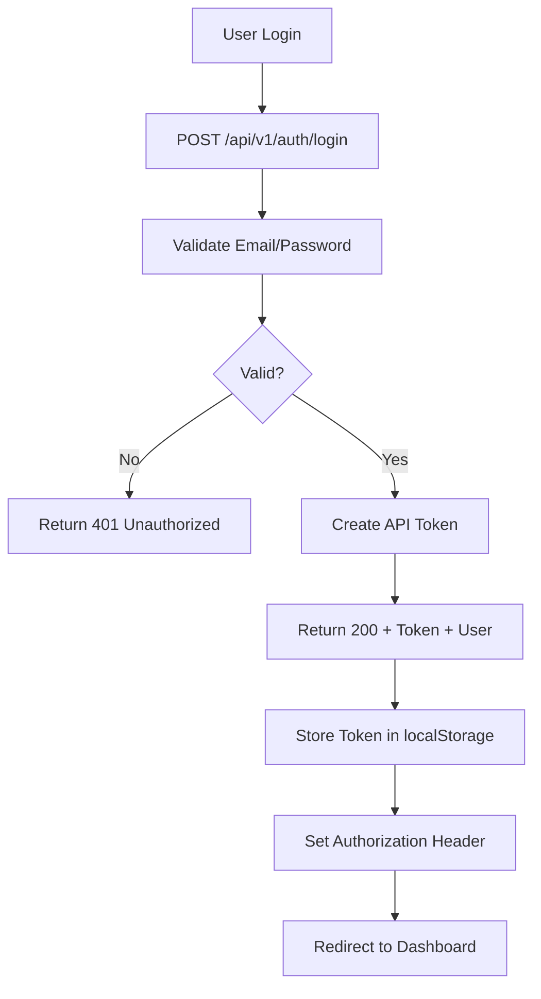
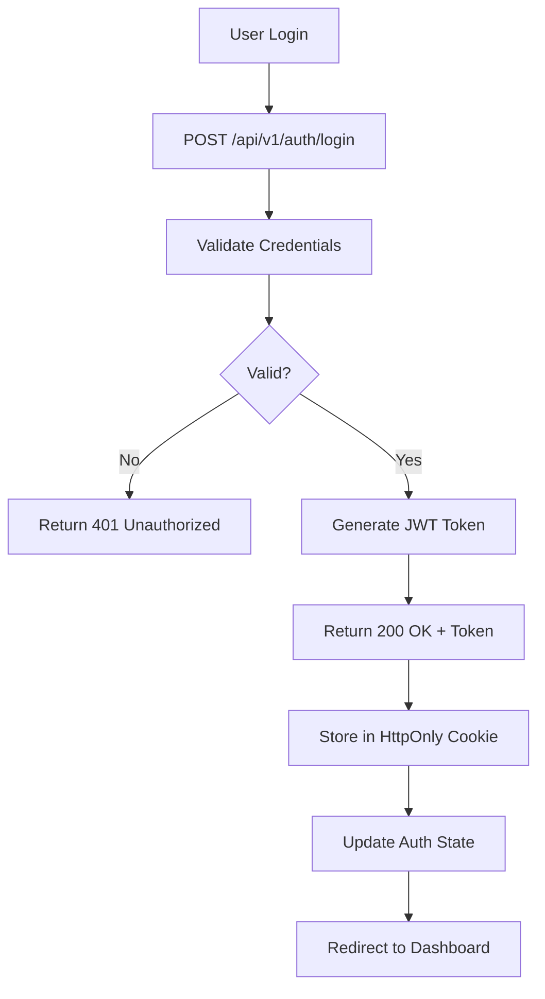
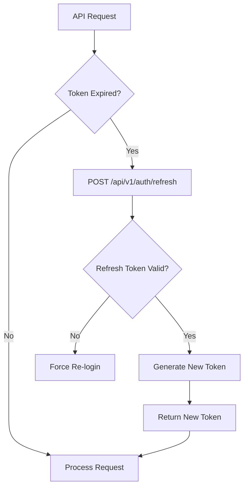
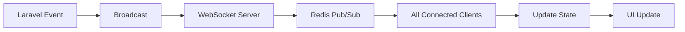

# Kiến Trúc Chi Tiết - CTRL/C CLUB Website

## Tầm Nhìn Kiến Trúc

Hệ thống được thiết kế theo mô hình **Microservices-inspired Monolith** với sự tách biệt rõ ràng giữa Frontend (Next.js 14) và Backend (Laravel 11). Kiến trúc ưu tiên tính mở rộng (scalability), bảo mật (security) và khả năng bảo trì (maintainability) cho quy mô dưới 1000 users.

---

## 1. Kiến Trúc Frontend (Next.js 14, TypeScript, Tailwind, Shadcn UI)

### 1.1 Cấu Trúc Mô-Đun

```
frontend/
├── src/
│   ├── app/                          # App Router (SSR, SSG, ISR)
│   │   ├── layout.tsx               # Root layout
│   │   ├── page.tsx                 # Trang chủ
│   │   ├── about/
│   │   │   └── page.tsx            # Trang thông tin CLB
│   │   ├── events/
│   │   │   ├── page.tsx            # Danh sách sự kiện (SSR)
│   │   │   └── [id]/
│   │   │       └── page.tsx        # Chi tiết sự kiện (SSR)
│   │   ├── forum/
│   │   │   ├── page.tsx            # Diễn đàn (SSR)
│   │   │   └── [id]/
│   │   │       └── page.tsx        # Chi tiết bài viết (SSR)
│   │   ├── auth/
│   │   │   ├── login/
│   │   │   │   └── page.tsx
│   │   │   └── register/
│   │   │       └── page.tsx
│   │   └── api/                     # Route handlers
│   ├── components/
│   │   ├── ui/                      # Shadcn UI components
│   │   ├── layout/                  # Layout components
│   │   └── features/                # Feature components
│   ├── services/                    # API service layer
│   ├── stores/                      # Zustand stores
│   ├── hooks/                       # Custom React hooks
│   ├── types/                       # TypeScript types
│   ├── lib/                         # Utilities
│   └── styles/                      # Global styles
└── public/                          # Static assets
```

### 1.2 Rendering Strategy

| Trang | Strategy | Lý Do |
|-------|----------|-------|
| `/` | **SSG** | Nội dung tĩnh, SEO, ưu tiên trang thông tin |
| `/about` | **SSG** | Nội dung cố định, SEO |
| `/events` | **SSR** | Dữ liệu thay đổi thường xuyên |
| `/events/[id]` | **SSR** | Cập nhật real-time |
| `/forum` | **SSR** | Real-time comments |
| `/auth/*` | **CSR** | Không cần SEO |

**ISR (Incremental Static Regeneration):**
- Trang chủ: `revalidate: 300` (5 phút)
- Balance performance và freshness

### 1.3 State Management

#### Client State (Zustand)
```typescript
interface AuthState {
  user: User | null;
  token: string | null;
  isAuthenticated: boolean;
  login: (email: string, password: string) => Promise<void>;
  logout: () => Promise<void>;
}
```
- Auth state, user preferences
- Lightweight, no boilerplate
- DevTools support

#### Server State (React Query)
- API caching, refetching, mutations
- Stale-while-revalidate strategy
- Optimistic updates
- Automatic retries
- Background refetching

### 1.4 Data Fetching Pattern

```typescript
// services/api.service.ts
const api = axios.create({
  baseURL: process.env.NEXT_PUBLIC_API_URL,
  timeout: 10000,
  headers: { 'Content-Type': 'application/json' },
});

// Request interceptor - Add auth token
api.interceptors.request.use((config) => {
  const token = localStorage.getItem('token');
  if (token) config.headers.Authorization = `Bearer ${token}`;
  return config;
});

// Response interceptor
api.interceptors.response.use(
  (response) => response,
  (error) => {
    if (error.response?.status === 401) {
      localStorage.removeItem('token');
      window.location.href = '/login';
    }
    return Promise.reject(error);
  }
);
```

### 1.5 Shadcn UI Integration

```bash
npx shadcn@latest init
npx shadcn@latest add card button input form badge dialog toast
```

**Component Example:**
```typescript
import { Card, CardContent, CardHeader, CardTitle } from '@/components/ui/card';
import { Button } from '@/components/ui/button';

export function EventCard({ event }: { event: Event }) {
  return (
    <Card className="hover:shadow-lg transition-shadow">
      <CardHeader>
        <CardTitle>{event.title}</CardTitle>
      </CardHeader>
      <CardContent>
        <p className="text-muted-foreground">{event.description}</p>
        <Button onClick={handleRegister}>Register</Button>
      </CardContent>
    </Card>
  );
}
```

### 1.6 Performance Optimizations

- **Code Splitting:** Automatic route-based (Next.js)
- **Image Optimization:** Next/Image with WebP
- **Lazy Loading:** Dynamic imports for heavy components
- **Memoization:** React.memo, useCallback, useMemo
- **Font Optimization:** Next.js font optimization
- **Preloading:** Link prefetch on hover

---

## 2. Kiến Trúc Backend (Laravel 11, MySQL, Sanctum, WebSockets)

### 2.1 Cấu Trúc Mô-Đun

```
backend/
├── app/
│   ├── Http/
│   │   ├── Controllers/
│   │   │   ├── Api/
│   │   │   │   ├── Auth/              # Auth controllers
│   │   │   │   │   ├── LoginController.php
│   │   │   │   │   ├── RegisterController.php
│   │   │   │   │   └── LogoutController.php
│   │   │   │   ├── EventController.php
│   │   │   │   ├── ForumController.php
│   │   │   │   └── UserController.php
│   │   │   └── Controller.php        # Base controller
│   │   ├── Requests/
│   │   │   ├── Auth/                 # Auth form requests
│   │   │   ├── StoreEventRequest.php
│   │   │   ├── StorePostRequest.php
│   │   │   └── UpdatePostRequest.php
│   │   ├── Responses/                # API responses
│   │   ├── Middleware/
│   │   │   ├── Authenticate.php
│   │   │   ├── CheckRole.php
│   │   │   └── Localization.php      # i18n middleware
│   │   └── Kernel.php
│   ├── Models/
│   │   ├── User.php                 # User model
│   │   ├── Event.php                # Event model
│   │   ├── Post.php                 # Forum post model
│   │   ├── Comment.php              # Comment model
│   │   └── Registration.php         # Event registration pivot
│   ├── Services/
│   │   ├── AuthService.php          # Auth business logic
│   │   ├── EventService.php         # Event business logic
│   │   ├── ForumService.php         # Forum business logic
│   │   └── NotificationService.php  # Notification logic
│   ├── Repositories/
│   │   ├── BaseRepository.php       # Base repository
│   │   ├── EventRepository.php      # Event data access
│   │   └── ForumRepository.php      # Forum data access
│   ├── Events/
│   │   ├── RegisteredForEvent.php   # Event registration event
│   │   ├── PostWasCreated.php       # New post event
│   │   └── CommentWasAdded.php      # New comment event
│   ├── Listeners/
│   │   ├── SendEventNotification.php
│   │   ├── BroadcastEvent.php
│   │   └── SendWelcomeEmail.php
│   ├── Jobs/
│   │   ├── SendEmailJob.php
│   │   ├── ProcessImageJob.php
│   │   └── CleanupOldRecords.php
│   └── Providers/
│       ├── AppServiceProvider.php
│       ├── AuthServiceProvider.php
│       ├── BroadcastServiceProvider.php
│       └── EventServiceProvider.php
├── database/
│   ├── migrations/                  # Schema migrations
│   ├── seeders/                     # Database seeders
│   │   ├── DatabaseSeeder.php
│   │   └── EventSeeder.php
│   └── factories/                   # Model factories
├── routes/
│   ├── api.php                      # API routes (v1)
│   ├── web.php                      # Web routes (auth)
│   └── channels.php                 # Broadcast channels
├── resources/
│   └── lang/                        # Localization
│       ├── en/                      # English translations
│       │   ├── auth.php
│       │   ├── pagination.php
│       │   └── validation.php
│       └── vi/                      # Vietnamese translations
│           ├── auth.php
│           ├── pagination.php
│           └── validation.php
└── tests/
    ├── Feature/                     # Feature tests
    ├── Unit/                        # Unit tests
    └── TestCase.php                 # Test base class
```

### 2.2 Design Patterns

#### Repository Pattern
```php
class EventRepository
{
    public function findUpcoming(int $limit = 10)
    {
        return $this->model
            ->where('start_time', '>', now())
            ->orderBy('start_time')
            ->limit($limit)
            ->get();
    }
}
```

#### Service Pattern
```php
class EventService
{
    public function registerUser(int $eventId, int $userId): array
    {
        // Business logic
        // Validation
        // Transaction
    }
}
```

#### Observer Pattern
```php
class EventObserver
{
    public function created(Event $event)
    {
        // Auto-slug generation
        $event->update([
            'slug' => Str::slug($event->title),
        ]);
    }
}
```

### 2.3 Layered Architecture

```
HTTP Request
    ↓
[Route] → routes/api.php
    ↓
[Middleware]
  → CORS
  → Rate Limit (100/15min)
  → Sanctum Auth
  → Localization
  ↓
[Controller] → Validation, Authorization
    ↓
[FormRequest] → Data validation
    ↓
[Service] → Business logic
    ↓
[Repository] → Data access
    ↓
[Model/Eloquent] → Database
    ↓
[Response] ← (Back up the chain)
    ↓
[Event] → Broadcast (WebSocket)
```

---

## 3. Database Schema (MySQL 8.0)

### 3.1 ER Diagram

```

     USERS      

  id (PK)       
  name          
  email (UQ)    
  password      
  role          
  status        
  created_at    

        
        1:N
        

REGISTRATIONS   

  user_id (PK)  
  event_id (PK) 
  status        
  created_at    

        
        N:1
        

    EVENTS      

  id (PK)       
  title         
  description   
  start_time    
  end_time      
  capacity      
  user_id (FK)  
  created_at    

        
        1:N
        

    POSTS       

  id (PK)       
  user_id (FK)  
  title         
  content       
  category      
  status        
  created_at    

        
        1:N
        

  COMMENTS      

  id (PK)       
  post_id (FK)  
  user_id (FK)  
  content       
  created_at    

```

### 3.2 Table Definitions

#### Users Table
```php
Schema::create('users', function (Blueprint $table) {
    $table->id();
    $table->string('name');
    $table->string('email')->unique();
    $table->timestamp('email_verified_at')->nullable();
    $table->string('password');
    $table->enum('role', ['member', 'moderator', 'admin'])->default('member');
    $table->boolean('is_active')->default(true);
    $table->rememberToken();
    $table->softDeletes();
    $table->timestamps();
    
    // Indexes
    $table->index('email');
    $table->index('role');
});
```

#### Events Table
```php
Schema::create('events', function (Blueprint $table) {
    $table->id();
    $table->string('title');
    $table->text('description');
    $table->dateTime('start_time');
    $table->dateTime('end_time');
    $table->integer('capacity')->default(50);
    $table->string('location');
    $table->string('status')->default('draft');
    $table->foreignId('created_by')->constrained('users');
    $table->softDeletes();
    $table->timestamps();
    
    // Indexes
    $table->index('start_time');
    $table->index('status');
    $table->index('created_by');
    
    // Full-text search
    $table->fullText(['title', 'description']);
});
```

#### Registrations (Pivot Table)
```php
Schema::create('event_user', function (Blueprint $table) {
    $table->foreignId('user_id')->constrained()->onDelete('cascade');
    $table->foreignId('event_id')->constrained()->onDelete('cascade');
    $table->enum('status', ['registered', 'attended', 'cancelled'])
          ->default('registered');
    $table->timestamps();
    
    // Unique constraint
    $table->unique(['user_id', 'event_id']);
    
    // Indexes
    $table->index('status');
});
```

#### Posts Table
```php
Schema::create('posts', function (Blueprint $table) {
    $table->id();
    $table->foreignId('user_id')->constrained()->onDelete('cascade');
    $table->string('title');
    $table->text('content');
    $table->string('category')->nullable();
    $table->enum('status', ['draft', 'published', 'archived'])
          ->default('published');
    $table->softDeletes();
    $table->timestamps();
    
    // Full-text search
    $table->fullText(['title', 'content']);
    
    // Indexes
    $table->index('category');
    $table->index('status');
});
```

#### Comments Table
```php
Schema::create('comments', function (Blueprint $table) {
    $table->id();
    $table->foreignId('post_id')->constrained()->onDelete('cascade');
    $table->foreignId('user_id')->constrained()->onDelete('cascade');
    $table->text('content');
    $table->timestamps();
    
    // Indexes
    $table->index('post_id');
    $table->index('user_id');
});
```

### 3.3 Index Strategy

**Foreign Keys:** Always indexed for join performance
**Frequent Queries:** status, category, created_at
**Full-Text:** title, content for search
**Unique Constraints:** Prevent duplicates

---

## 4. Authentication Flow (Laravel Sanctum)

### 4.1 Login Flow



### 4.2 Sanctum Configuration

`config/sanctum.php`:

```php
return [
    'stateful' => [
        'localhost',
        'localhost:3000',
        '127.0.0.1',
        '127.0.0.1:8000',
    ],
    
    'guard' => ['web'],
    
    'expiration' => null, // Token doesn't expire
    
    'token_prefix' => '',
];
```

### 4.3 Token Management

```php
// Login Controller
public function login(LoginRequest $request)
{
    $user = User::where('email', $request->email)->first();
    
    if (!$user || !Hash::check($request->password, $user->password)) {
        return response()->json([
            'error' => 'Invalid credentials',
        ], 401);
    }
    
    $token = $user->createToken('web-token')->plainTextToken;
    
    return response()->json([
        'token' => $token,
        'user' => new UserResource($user),
    ]);
}

// Logout Controller
public function logout(Request $request)
{
    $request->user()->currentAccessToken()->delete();
    
    return response()->json(['message' => 'Logged out']);
}
```

### 4.4 Middleware Stack

```
Request → [CORS] → [Rate Limit] → [Sanctum] → [Auth] → [Role Check] → Controller
  ↓           ↓         ↓              ↓          ↓          ↓
Origin    100/15m    Bearer Token   User Set   Admin?     Proceed
Check
```

---

## 5. Real-Time Architecture (Laravel WebSockets + Pusher)

### 5.1 WebSocket Configuration

`config/websockets.php`:

```php
return [
    'apps' => [
        [
            'id' => env('PUSHER_APP_ID'),
            'name' => env('APP_NAME'),
            'key' => env('PUSHER_APP_KEY'),
            'secret' => env('PUSHER_APP_SECRET'),
            'path' => env('PUSHER_APP_PATH'),
            'capacity' => null,
            'enable_client_messages' => false,
            'enable_statistics' => true,
        ],
    ],
    
    'app_provider' => BeyondCode\LaravelWebSockets\Apps\ConfigAppProvider::class,
    
    'statistics' => [
        'model' => \BeyondCode\LaravelWebSockets\Statistics\Models\WebSocketsStatisticsEntry::class,
        'interval_in_seconds' => 60,
        'delete_statistics_older_than_days' => 60,
    ],
];
```

### 5.2 Broadcast Channels

`routes/channels.php`:

```php
use Illuminate\Support\Facades\Broadcast;

Broadcast::channel('forum', function ($user) {
    return true; // Public channel
});

Broadcast::channel('events.{eventId}', function ($user, $eventId) {
    return $user->can('view', Event::findOrFail($eventId));
});

Broadcast::channel('users.{userId}', function ($user, $userId) {
    return (int) $user->id === (int) $userId;
});
```

### 5.3 Event Broadcasting

```php
// RegisteredForEvent.php
class RegisteredForEvent implements ShouldBroadcast
{
    use Dispatchable, InteractsWithSockets, SerializesModels;

    public $registration;
    
    public function __construct(Registration $registration)
    {
        $this->registration = $registration;
    }

    public function broadcastOn()
    {
        return [
            new Channel('events.' . $this->registration->event_id),
            new PrivateChannel('users.' . $this->registration->user_id),
        ];
    }

    public function broadcastAs()
    {
        return 'registration.created';
    }
}
```

### 5.4 Frontend Integration

```typescript
// hooks/useWebSocket.ts
import Echo from 'laravel-echo';
import Pusher from 'pusher-js';

const echo = new Echo({
  broadcaster: 'pusher',
  key: process.env.NEXT_PUBLIC_PUSHER_KEY,
  cluster: process.env.NEXT_PUBLIC_PUSHER_CLUSTER,
  wsHost: window.location.hostname,
  wsPort: 6001,
  wssPort: 6001,
  forceTLS: false,
  disableStats: true,
  enabledTransports: ['ws', 'wss'],
});

// Listen to forum updates
echo.channel('forum')
  .listen('PostWasCreated', (e) => {
    queryClient.invalidateQueries({ queryKey: ['posts'] });
  });
```

### 5.5 WebSocket Server

`.env`:
```env
BROADCAST_DRIVER=pusher
PUSHER_APP_ID=local
PUSHER_APP_KEY=local
PUSHER_APP_SECRET=local
PUSHER_HOST=127.0.0.1
PUSHER_PORT=6001
PUSHER_SCHEME=http
```

Start WebSocket server:
```bash
php artisan websockets:serve
```

---

## 6. Localization (i18n)

### 6.1 Laravel Localization

`config/app.php`:

```php
'locale' => 'vi',
'fallback_locale' => 'en',
```

### 6.2 Language Files

`resources/lang/vi/auth.php`:

```php
return [
    'failed' => 'Thông tin đăng nhập không chính xác.',
    'password' => 'Mật khẩu không chính xác.',
    'throttle' => 'Quá nhiều lần đăng nhập. Vui lòng thử lại sau :seconds giây.',
];
```

`resources/lang/en/auth.php`:

```php
return [
    'failed' => 'These credentials do not match our records.',
    'password' => 'The provided password is incorrect.',
    'throttle' => 'Too many login attempts. Please try again in :seconds seconds.',
];
```

### 6.3 Middleware

`app/Http/Middleware/Localization.php`:

```php
class Localization
{
    public function handle($request, Closure $next)
    {
        $locale = $request->get('lang', session('locale', config('app.locale')));
        
        if (in_array($locale, ['en', 'vi'])) {
            app()->setLocale($locale);
            session(['locale' => $locale]);
        }
        
        return $next($request);
    }
}
```

### 6.4 Frontend i18n

```bash
npm install react-i18next i18next
```

`src/lib/i18n.ts`:

```typescript
import i18n from 'i18next';
import { initReactI18next } from 'react-i18next';

const resources = {
  en: {
    translation: {
      "Welcome": "Welcome",
      "Events": "Events",
    }
  },
  vi: {
    translation: {
      "Welcome": "Chào mừng",
      "Events": "Sự kiện",
    }
  }
};

i18n.use(initReactI18next).init({
  resources,
  lng: 'vi',
  fallbackLng: 'en',
});

export default i18n;
```

---

## 7. Storage Architecture (Local)

### 7.1 File Storage Configuration

`config/filesystems.php`:

```php
return [
    'default' => 'local',
    
    'disks' => [
        'local' => [
            'driver' => 'local',
            'root' => storage_path('app/public'),
            'url' => env('APP_URL') . '/storage',
            'visibility' => 'public',
        ],
        
        'uploads' => [
            'driver' => 'local',
            'root' => storage_path('app/public/uploads'),
            'url' => env('APP_URL') . '/storage/uploads',
            'visibility' => 'public',
        ],
    ],
];
```

### 7.2 File Upload Examples

```php
// Event image upload
$path = $request->file('image')->store('events', 'uploads');

$event->update([
    'image_url' => Storage::disk('uploads')->url($path),
]);
```

```typescript
// Frontend upload
const formData = new FormData();
formData.append('image', file);

await api.post('/api/v1/upload', formData, {
  headers: {
    'Content-Type': 'multipart/form-data',
  },
});
```

---

## 8. Cache Strategy

### 8.1 Cache Configuration

`config/cache.php`:

```php
return [
    'default' => env('CACHE_DRIVER', 'array'),
    
    'stores' => [
        'array' => [
            'driver' => 'array',
        ],
        
        'file' => [
            'driver' => 'file',
            'path' => storage_path('framework/cache/data'),
        ],
    ],
];
```

### 8.2 Cache Usage

```php
// Cache frequent queries
$events = Cache::remember('events:upcoming', 300, function () {
    return Event::upcoming()->with('user')->get();
});

// Clear cache on update
Cache::forget('events:upcoming');
```

---

## 9. API Documentation (Swagger)

### 9.1 L5-Swagger Setup

```bash
composer require "darkaonline/l5-swagger:8.*"
php artisan vendor:publish --provider="L5Swagger\L5SwaggerServiceProvider"
```

### 9.2 OpenAPI Annotations

```php
/**
 * @OA\Get(
 *     path="/api/v1/events",
 *     summary="Lấy danh sách sự kiện",
 *     tags={"Events"},
 *     security={},
 *     @OA\Parameter(
 *         name="page",
 *         in="query",
 *         description="Số trang",
 *         @OA\Schema(type="integer")
 *     ),
 *     @OA\Response(response=200, description="Thành công")
 * )
 */
public function index() { ... }
```

View docs at: `http://localhost:8000/docs/api`

---

## 10. CI/CD Pipeline (GitHub Actions)

### 10.1 Workflow Configuration

`.github/workflows/ci-cd.yml`:

```yaml
name: CI/CD Pipeline

on:
  push:
    branches: [ main, develop ]
  pull_request:
    branches: [ main ]

jobs:
  test:
    runs-on: ubuntu-latest
    
    services:
      mysql:
        image: mysql:8.0
        env:
          MYSQL_ROOT_PASSWORD: root
          MYSQL_DATABASE: testing
        ports:
          - 3306:3306
      
      redis:
        image: redis:7-alpine
        ports:
          - 6379:6379

    steps:
      - uses: actions/checkout@v3

      - name: Setup PHP
        uses: shivammathur/setup-php@v2
        with:
          php-version: '8.2'
          coverage: xdebug

      - name: Setup Node.js
        uses: actions/setup-node@v3
        with:
          node-version: '20'

      - name: Cache dependencies
        uses: actions/cache@v3
        with:
          path: vendor
          key: php-${{ hashFiles('**/composer.lock') }}

      - name: Install backend deps
        working-directory: ./backend
        run: composer install --no-progress

      - name: Install frontend deps
        working-directory: ./frontend
        run: npm ci

      - name: Run migrations
        working-directory: ./backend
        run: php artisan migrate
        env:
          DB_CONNECTION: mysql
          DB_HOST: 127.0.0.1
          DB_DATABASE: testing

      - name: Run PHPUnit
        working-directory: ./backend
        run: php artisan test --coverage --min=80

      - name: Run Jest
        working-directory: ./frontend
        run: npm run test -- --coverage --coverageThreshold='{"global":{"branches":80,"functions":80,"lines":80,"statements":80}}'

      - name: Run E2E tests
        working-directory: ./frontend
        run: npm run e2e
```

---

## 11. Monitoring and Logging

### 11.1 Application Logs

```bash
# Tail Laravel logs
tail -f storage/logs/laravel.log

# Filter errors
grep -i error storage/logs/laravel.log
```

### 11.2 WebSocket Statistics

Access at: `http://localhost:8000/laravel-websockets/statistics`

### 11.3 Health Checks

```php
// routes/api.php
Route::get('/health', function () {
    try {
        DB::connection()->getPdo();
        return response()->json(['status' => 'healthy']);
    } catch (\Exception $e) {
        return response()->json(['status' => 'unhealthy'], 500);
    }
});
```

---

## 12. Security Best Practices

### 12.1 Authentication
- JWT tokens with Sanctum
- Token stored in localStorage
- HTTPS enforced in production
- CSRF protection for web routes

### 12.2 Input Validation
- FormRequest for all inputs
- Server-side validation always
- XSS prevention with Purifier

### 12.3 Database Security
- Parameterized queries (Eloquent)
- Foreign key constraints
- Soft deletes for recovery

### 12.4 Rate Limiting
```php
// config/sanctum.php
'limit' => 100,
'expires' => 15, // minutes
```

---

## 13. Scalability Considerations

### 13.1 Current Architecture
- Monolith suitable for <1000 users
- Single database instance
- File-based cache

### 13.2 Future Scaling
- Database read replicas
- Redis for sessions/cache
- Queue workers for async tasks
- CDN for static assets

---

## 14. Technology Stack Summary

| Layer | Technology | Version | Purpose |
|-------|-----------|---------|----------|
| Frontend | Next.js | 14.x | React framework with SSR |
| | TypeScript | 5.x | Type safety |
| | Tailwind CSS | 3.x | Styling |
| | Shadcn UI | latest | Component library |
| Backend | Laravel | 11.x | PHP framework |
| | MySQL | 8.0+ | Database |
| Real-time | Laravel WebSockets | 1.x | Self-hosted WebSocket |
| Auth | Laravel Sanctum | - | Token-based authentication |
| Testing | PHPUnit | 10.x | Backend tests |
| | Jest | 29.x | Frontend unit tests |
| | Playwright | 1.x | E2E tests |
| CI/CD | GitHub Actions | - | Automation |
| Docs | Swagger/OpenAPI | - | API documentation |

### 1.4 Data Fetching Pattern

```typescript
// services/api.ts
import axios from 'axios';

const api = axios.create({
  baseURL: process.env.NEXT_PUBLIC_API_URL,
  timeout: 10000,
  headers: { 'Content-Type': 'application/json' },
});

// Request interceptor - Add auth token
api.interceptors.request.use((config) => {
  const token = getCookie('token');
  if (token) {
    config.headers.Authorization = `Bearer ${token}`;
  }
  return config;
});

// Response interceptor - Handle errors
api.interceptors.response.use(
  (response) => response,
  (error) => {
    if (error.response?.status === 401) {
      window.location.href = '/login';
    }
    return Promise.reject(error);
  }
);
```

### 1.5 Performance Optimizations

- **Code Splitting:** Automatic route-based (Next.js)
- **Image Optimization:** Next/Image component
- **Preloading:** Link prefetch on hover
- **Lazy Loading:** Dynamic imports for heavy components
- **Memoization:** React.memo, useCallback, useMemo

---

## 2. Kiến Trúc Backend (Laravel)

### 2.1 Cấu Trúc Mô-Đun

```
backend/
├── app/
│   ├── Http/
│   │   ├── Controllers/             # API Controllers
│   │   ├── Requests/                # Form Requests
│   │   └── Middleware/              # Custom middleware
│   ├── Models/                      # Eloquent Models
│   ├── Services/                    # Business logic
│   ├── Repositories/                # Data access layer
│   ├── Events/                      # Domain events
│   ├── Listeners/                   # Event listeners
│   ├── Jobs/                        # Queue jobs
│   └── Providers/                   # Service providers
├── database/                        # Migrations, seeders
└── routes/
    ├── api.php                      # API routes
    ├── web.php                      # Web routes
    └── channels.php                 # Broadcast channels
```

### 2.2 Design Patterns

#### Repository Pattern
```php
// app/Repositories/EventRepository.php
class EventRepository
{
    public function findUpcoming(int $limit = 10)
    {
        return $this->model
            ->where('date', '>', now())
            ->orderBy('date')
            ->limit($limit)
            ->get();
    }
}
```

#### Service Pattern
```php
// app/Services/EventService.php
class EventService
{
    public function registerUser(int $eventId, int $userId): array
    {
        // Business logic
        // Validation
        // Transaction
    }
}
```

#### Observer Pattern
```php
// app/Observers/EventObserver.php
class EventObserver
{
    public function created(Event $event)
    {
        // Auto-slug generation
    }
}
```

### 2.3 Layered Architecture

```
HTTP Request
    ↓
[Route] → api.php
    ↓
[Middleware] → Auth, RateLimit, CORS
    ↓
[Controller] → Validation, Authorization
    ↓
[FormRequest] → Data validation
    ↓
[Service] → Business logic
    ↓
[Repository] → Data access
    ↓
[Model/Eloquent] → Database
    ↓
[Response] ← (Back up the chain)
```

### 2.4 API Structure

**RESTful Design:**
```
GET    /api/v1/events              # List events
POST   /api/v1/events              # Create event
GET    /api/v1/events/{id}         # Show event
PUT    /api/v1/events/{id}         # Update event
DELETE /api/v1/events/{id}         # Delete event
POST   /api/v1/events/{id}/register  # Register for event
```

**Versioning:** `/api/v1/` - URL-based for backward compatibility

---

## 3. Database Schema

### 3.1 ER Diagram

```
USERS ────< REGISTRATIONS >───── EVENTS
  │                               │
  │                               │
  └───< POSTS ────< COMMENTS      └───(creator)
```

### 3.2 Table Definitions

#### Users Table
```php
Schema::create('users', function (Blueprint $table) {
    $table->id();
    $table->string('name');
    $table->string('email')->unique();
    $table->timestamp('email_verified_at')->nullable();
    $table->string('password');
    $table->enum('role', ['member', 'moderator', 'admin'])->default('member');
    $table->softDeletes();
    $table->timestamps();
});
```

#### Events Table
```php
Schema::create('events', function (Blueprint $table) {
    $table->id();
    $table->string('title');
    $table->text('description');
    $table->dateTime('start_time');
    $table->dateTime('end_time');
    $table->integer('capacity')->default(50);
    $table->foreignId('created_by')->constrained('users');
    $table->softDeletes();
    $table->timestamps();
});
```

#### Registrations (Pivot Table)
```php
Schema::create('event_user', function (Blueprint $table) {
    $table->foreignId('user_id')->constrained()->onDelete('cascade');
    $table->foreignId('event_id')->constrained()->onDelete('cascade');
    $table->enum('status', ['registered', 'attended', 'cancelled'])->default('registered');
    $table->unique(['user_id', 'event_id']);
});
```

#### Posts Table
```php
Schema::create('posts', function (Blueprint $table) {
    $table->id();
    $table->foreignId('user_id')->constrained()->onDelete('cascade');
    $table->string('title');
    $table->text('content');
    $table->string('category')->nullable();
    $table->enum('status', ['draft', 'published', 'archived'])->default('published');
    $table->softDeletes();
    $table->timestamps();
});
```

#### Comments Table
```php
Schema::create('comments', function (Blueprint $table) {
    $table->id();
    $table->foreignId('post_id')->constrained()->onDelete('cascade');
    $table->foreignId('user_id')->constrained()->onDelete('cascade');
    $table->text('content');
    $table->timestamps();
});
```

### 3.3 Indexes
```php
// Foreign keys
$table->index('user_id');
$table->index('event_id');
$table->index('post_id');

// Frequent queries
$table->index('start_time');
$table->index('status');
$table->index('created_at');
```

---

## 4. Authentication Flow

### 4.1 Login Flow



### 4.2 Token Refresh



### 4.3 Middleware Stack

```
Request → [CORS] → [Rate Limit] → [Sanctum] → [Auth] → [Role Check] → Controller
  ↓           ↓          ↓              ↓          ↓           ↓
Origin    100/15m    Bearer Token   User Set   Admin?     Proceed
Check
```

---

## 5. Real-Time Architecture

### 5.1 WebSocket Flow



### 5.2 Channels

**Public Channels:**
- `forum` - New posts/comments
- `events` - Registration updates

**Private Channels:**
- `App.Models.User.{id}` - User-specific notifications
- `App.Models.Event.{id}` - Event updates

### 5.3 Event Types

```php
// EventRegistered.php
class EventRegistered implements ShouldBroadcast
{
    public function broadcastOn()
    {
        return new Channel('events.' . $this->event->id);
    }
}

// PostCreated.php
class PostCreated implements ShouldBroadcast
{
    public function broadcastOn()
    {
        return new Channel('forum');
    }
}
```

---

## 6. Security Architecture

### 6.1 Authentication Layers

```
Layer 1: HTTPS/TLS 1.3 (Transport)
  ↓
Layer 2: JWT Token (Stateless Auth)
  ↓
Layer 3: Sanctum (SPA Authentication)
  ↓
Layer 4: Rate Limiting (Brute Force)
  ↓
Layer 5: CSRF Protection (State-changing)
```

### 6.2 Data Protection

**Encryption:**
- Passwords: bcrypt (cost factor: 10)
- Sensitive data: AES-256
- HTTPS everywhere (HSTS)

**Validation:**
```php
// FormRequest validation
public function rules()
{
    return [
        'email' => 'required|email|unique:users',
        'password' => 'required|min:8|confirmed',
    ];
}
```

**SQL Injection Prevention:**
- Eloquent (parameterized queries)
- Query Builder (parameterized)
- Never raw queries with user input

**XSS Prevention:**
- Blade auto-escaping
- Purifier for HTML content
- Content-Security-Policy headers

**CSRF Protection:**
```php
// Web routes: Automatic
// API routes: Sanctum tokens
// SPA: csrf-cookie endpoint
```

---

## 7. Performance Architecture

### 7.1 Caching Strategy

**Frontend:**
```typescript
// React Query
const { data } = useQuery({
  queryKey: ['events'],
  queryFn: fetchEvents,
  staleTime: 5 * 60 * 1000,  // 5 min
  gcTime: 30 * 60 * 1000,    // 30 min
});
```

**Backend:**
```php
// Redis caching
Cache::remember('events:upcoming', 300, function () {
    return Event::upcoming()->get();
});
```

**HTTP Caching:**
```php
// Response cache
return response($data)
    ->header('Cache-Control', 'public, max-age=300');
```

### 7.2 Database Optimization

**Indexes:**
```php
$table->index('created_by');
$table->index('status');
$table->index('start_time');
```

**Eager Loading:**
```php
// Good: Prevents N+1
Event::with('user', 'registrations')->get();

// Bad: N+1 problem
$events = Event::all();
foreach ($events as $event) {
    echo $event->user->name;  // Extra query each iteration
}
```

**Query Optimization:**
```php
// Select only needed columns
Event::select('id', 'title', 'date')->get();

// Paginate instead of all
Event::paginate(20);
```

### 7.3 Queue System

```php
// Dispatch to queue
SendEventNotification::dispatch($user, $event)->onQueue('notifications');

// Process queue
php artisan queue:work --queue=notifications
```

**Queue Workers:**
```
- Default: sync (immediate)
- Redis: async (background)
- Database: fallback
```

---

## 8. Deployment Architecture

### 8.1 Infrastructure

```

                    Load Balancer                      
                 (Nginx / AWS ALB)                    

                           
            
                                          
               
         Frontend               Backend 
         (Vercel)               (Forge)  
               
                                          
            
                           
                           
                  
                     Redis (Cache) 
                    
                           
                  
                     MySQL (DB)    
                    
```

### 8.2 Environment Separation

```
.env.local          # Local development
.env.staging        # Staging environment
.env.production     # Production environment
```

**Environment Variables:**
```bash
# Frontend
NEXT_PUBLIC_API_URL=https://api.ctrlcclub.com
NEXT_PUBLIC_WS_URL=wss://api.ctrlcclub.com

# Backend
APP_ENV=production
APP_DEBUG=false
DB_HOST=127.0.0.1
REDIS_HOST=127.0.0.1
```

### 8.3 CI/CD Pipeline

```yaml
# GitHub Actions
name: Deploy
on:
  push:
    branches: [main]

jobs:
  test:
    runs-on: ubuntu-latest
    steps:
      - uses: actions/checkout@v2
      - name: Run Frontend Tests
        run: npm run test
      - name: Run Backend Tests
        run: php artisan test

  deploy:
    needs: test
    runs-on: ubuntu-latest
    steps:
      - name: Deploy to Vercel
        run: vercel --prod
      - name: Deploy to Forge
        run: forge deploy
```

---

## 9. Monitoring and Logging

### 9.1 Application Monitoring

**Frontend:**
- Sentry for error tracking
- Google Analytics for usage
- Lighthouse for performance

**Backend:**
- Laravel Telescope (development)
- Laravel Horizon (queues)
- Custom application logs

**Database:**
- Slow query log (>100ms)
- Query count monitoring
- Index usage analysis

### 9.2 Log Levels

```php
// Emergency: system is unusable
Log::emergency('Database connection lost');

// Alert: action must be taken
Log::alert('SSL certificate expiring');

// Critical: critical conditions
Log::critical('Application unavailable');

// Error: runtime errors
Log::error('Payment processing failed');

// Warning: warning conditions
Log::warning('Disk space low');

// Notice: normal but significant
Log::notice('User registered');

// Info: informational messages
Log::info('User logged in');

// Debug: debug information
Log::debug('Query executed', ['sql' => $sql]);
```

---

## 10. Scalability Considerations

### 10.1 Horizontal Scaling

**Frontend:**
- CDN distribution (Vercel)
- Edge caching
- Stateless architecture

**Backend:**
- Load balancer (multi-server)
- Session sharing (Redis)
- Database read replicas

**Database:**
- Master-slave replication
- Read/write splitting
- Partitioning by date

### 10.2 Microservices Migration Path

```
Current: Monolith
  ↓
Step 1: Extract Auth Service
  ↓
Step 2: Extract Notification Service
  ↓
Step 3: Extract Analytics Service
  ↓
Future: Microservices
```

---

## 11. API Documentation Standards

### 11.1 OpenAPI/Swagger

```php
/**
 * @OA\Get(
 *     path="/api/v1/events",
 *     summary="Get all events",
 *     @OA\Response(response=200, description="Successful response")
 * )
 */
public function index()
{
    return Event::all();
}
```

### 11.2 Postman Collection

- Export/import API collection
- Environment variables
- Automated testing

---

## 12. Best Practices Summary

### Frontend
1. Component composition over inheritance
2. TypeScript for type safety
3. React Query for server state
4. Lazy loading for performance
5. Comprehensive test coverage

### Backend
1. Repository pattern for testability
2. Service layer for business logic
3. FormRequest for validation
4. Eloquent for queries
5. Queue for async tasks

### Database
1. Foreign key constraints
2. Proper indexing
3. Soft deletes for recovery
4. Migrations for versioning
5. Regular backups

### Security
1. HTTPS everywhere
2. JWT for authentication
3. Rate limiting
4. Input validation
5. SQL injection prevention

---

## 13. Technology Stack

| Layer | Technology | Purpose |
|-------|------------|---------|
| Frontend | Next.js 13 | SSR, React framework |
| Frontend | TypeScript | Type safety |
| Frontend | Tailwind CSS | Styling |
| Frontend | React Query | Server state |
| Frontend | Zustand | Client state |
| Backend | Laravel 10 | PHP framework |
| Backend | PHP 8.x | Runtime |
| Backend | Eloquent | ORM |
| Database | MySQL 8.0 | Relational DB |
| Cache | Redis | Caching, sessions |
| Queue | Redis | Async tasks |
| Realtime | Laravel WebSockets | WebSocket server |
| Deployment | Vercel | Frontend hosting |
| Deployment | Forge | Backend hosting |

---

## Conclusion

This architecture document provides a comprehensive overview of the CTRL/C CLUB Website's technical design. It covers:

1. **Frontend Architecture:** Next.js, React, TypeScript patterns
2. **Backend Architecture:** Laravel, PHP patterns
3. **Database Design:** Schema, relationships, optimization
4. **Authentication:** JWT, middleware flow
5. **Real-time:** WebSocket implementation
6. **Security:** Multi-layered protection
7. **Performance:** Caching, optimization strategies
8. **Deployment:** Infrastructure, CI/CD
9. **Monitoring:** Logging, observability
10. **Scalability:** Growth strategies

For implementation details, refer to:
- [Onboarding Guide](./onboarding.md) - Getting started
- [Dev Guide](./dev-guide.md) - Development workflow
- [System Flow](./system-flow.md) - Data flow overview
- [API Guide](./api-guide.md) - Endpoint specifics