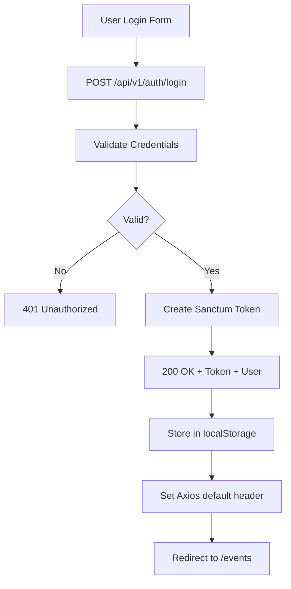
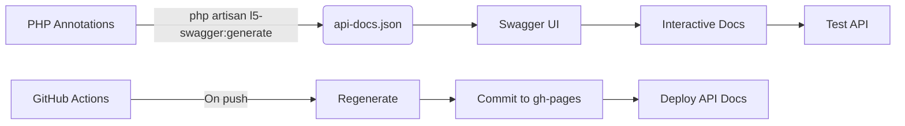
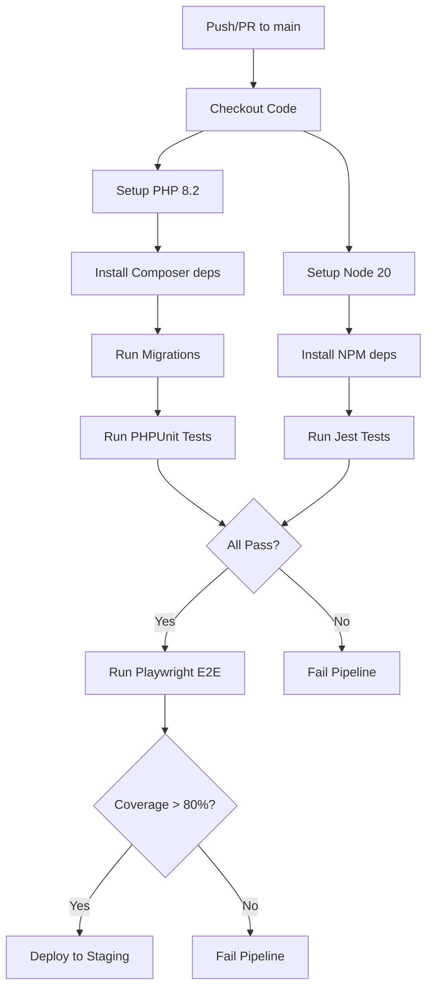

# Sơ Đồ Luồng Hệ Thống - CTRL/C CLUB Website

## Tổng Quan

Sơ đồ luồng dữ liệu và các chức năng chính của hệ thống CTRL/C CLUB Website bao gồm 3 module chính: **Trang thông tin**, **Đăng ký sự kiện**, và **Diễn đàn thảo luận**.

Hệ thống sử dụng kiến trúc tách biệt Frontend (Next.js 14, TypeScript, Tailwind CSS, Shadcn UI) và Backend (Laravel 11, MySQL, Sanctum, WebSockets) với Dev Containers setup để đồng bộ môi trường phát triển.

---

## 1. Kiến Trúc Hệ Thống Tổng Quan

```

                        USER (Browser)                          
  (Thành viên CLB, Quản trị viên, Khách truy cập)              

                            
         
                            HTTPS (REST API) / WebSocket
           
                            
     
       Frontend              Backend          
     (Next.js 14)           (Laravel 11)       
                       
     • TypeScript         • Eloquent ORM       
     • Tailwind CSS       • MySQL 8.0          
     • Shadcn UI          • Laravel Sanctum    
     • React Query        • WebSockets         
     • Zustand            • Local Storage      
     • i18n               • File Cache         
                            
         ↑                      ↑              
         |                      |              
    GA4 Tracking          Swagger/OpenAPI      
                            
         
                            WebSocket (Pusher)
           
                            
                    
                      Database   
                       (MySQL)    
                    
                           ↑
                    
                       Redis   
                     (Cache)   
                    
```

---

## 2. Luồng Dữ Liệu Chung

### 2.1 Request Flow (API)

```
1. User Interaction (Browser)
   ↓
2. Frontend Component (Next.js 14)
   ↓
3. API Service (Axios + TypeScript)
   ↓
4. HTTPS Request → Backend (Laravel 11)
   ↓
5. CORS Middleware
   ↓
6. Rate Limiter (100 requests/15min)
   ↓
7. Sanctum Authentication
   ↓
8. Localization Middleware (i18n)
   ↓
9. Route (routes/api.php)
   ↓
10. Controller (Validation & Authorization)
   ↓
11. FormRequest (Data Validation)
   ↓
12. Service Layer (Business Logic)
   ↓
13. Repository (Data Access Layer)
   ↓
14. Eloquent Model → MySQL
   ↓
15. Response + Event Dispatch
   ↓
16. WebSocket Broadcast (if subscribed)
   ↓
17. Response ← (Back up the chain)
   ↓
18. Frontend Cache Update (React Query)
   ↓
19. UI Re-render (State Update)
```

### 2.2 Request Flow (Web Page)

```
1. Browser Request
   ↓
2. Next.js Server (SSR/SSG)
   ↓
3. Fetch Initial Data (API/DB)
   ↓
4. Generate HTML
   ↓
5. Send Response to Browser
   ↓
6. Hydrate React Components
   ↓
7. Interactive Client-Side App
```

---

## 3. Chức Năng 1: Trang Thông Tin (Information Page)

### 3.1 Luồng Hiển Thị Trang Thông Tin

```
[USER] → GET /about (hoặc /)
   ↓
[NEXT.JS] SSG: getStaticProps()
   ↓
[API] GET /api/v1/info (hoặc nội dung tĩnh)
   ↓
[LARAVEL] InfoController@index()
   ↓
[MYSQL] SELECT từ bảng settings/content
   ↓
[RESPONSE] JSON { about, mission, team, contact }
   ↓
[NEXT.JS] Generate static HTML
   ↓
[CDN] Cache tại Vercel (nếu deploy)
   ↓
[USER] Xem trang thông tin (SSG, load nhanh)
```

### 3.2 Tính Năng SEO (i18n)

```
[USER] → Chọn ngôn ngữ (EN/VI)
   ↓
[FRONTEND] i18n thay đổi locale
   ↓
[API] Header: Accept-Language: vi|en
   ↓
[LARAVEL] Localization Middleware
   ↓
[RESPONSE] Dữ liệu đa ngôn ngữ
   ↓
[NEXT.JS] Cập nhật giao diện
```

### 3.3 Google Analytics 4

```
[USER] → Truy cập trang
   ↓
[FRONTEND] GA4 page_view event
   ↓
[GA4] Thu thập dữ liệu
   ↓
[DASHBOARD] Báo cáo lượt xem, hành vi
```

---

## 4. Chức Năng 2: Hệ Thống Đăng Ký Sự Kiện

### 4.1 Luồng Đăng Ký

```
[USER] → Truy cập /events → Xem danh sách
   ↓
[FRONTEND] useEvents() → GET /api/v1/events
   ↓
[LARAVEL] EventController@index()
   ↓
[MYSQL] Query with pagination, filters
   ↓
[RESPONSE] { data: [...], pagination: {...} }
   ↓
[FRONTEND] Hiển thị EventCard (Shadcn UI)
   ↓
[USER] Click "Register" → Kiểm tra đăng nhập
   ↓
   → Chưa đăng nhập → Redirect /login
   → Đã đăng nhập → Tiếp tục
   ↓
[FRONTEND] POST /api/v1/events/{id}/register
   ↓
[LARAVEL] EventController@register()
   ↓
[SERVICE] Kiểm tra capacity, duplicate
   ↓
[DATABASE] INSERT INTO event_user
   ↓
[EVENT] RegisteredForEvent dispatched
   ↓
[WEBSOCKET] Broadcast to channel
   ↓
[EMAIL] Queue notification (nếu có)
   ↓
[RESPONSE] 201 { registration }
   ↓
[FRONTEND] Cập nhật cache, hiện toast
   ↓
[WEBSOCKET] Admin dashboard cập nhật (real-time)
```

### 4.2 Luồng Hủy Đăng Ký

```
[USER] → Click "Hủy đăng ký"
   ↓
[API] DELETE /api/v1/events/{id}/register
   ↓
[LARAVEL] DELETE FROM event_user
   ↓
[WEBSOCKET] Broadcast update
   ↓
[RESPONSE] 200 OK
   ↓
[FRONTEND] Cập nhật UI
```

### 4.3 Luồng Real-time Notification

```
[EVENT] User đăng ký
   ↓
[LARAVEL] Event fired
   ↓
[WEBSOCKET SERVER] Nhận event
   ↓
[CHANNEL] events.{event_id}
   ↓
[SUBSCRIBE] Tất cả client đang xem sự kiện
   ↓
[FRONTEND] Nhận message WebSocket
   ↓
[REACT QUERY] Invalidate cache
   ↓
[UI] Cập nhật số lượng đăng ký
```

---

## 5. Chức Năng 3: Diễn Đàn Thảo Luận

### 5.1 Luồng Tạo Bài Viết

```
[USER] → Click "Viết bài" → Mở form
   ↓
[EDITOR] Quill/Tiptap (rich text)
   ↓
[USER] Điền {title, content, category}
   ↓
[VALIDATION] React Hook Form + Zod
   ↓
[API] POST /api/v1/forum/posts
   ↓
[LARAVEL] PostController@store()
   ↓
[VALIDATION] StorePostRequest
   ↓
[SECURITY] XSS Purifier (HTML content)
   ↓
[DATABASE] INSERT INTO posts
   ↓
[SEARCH] Index vào full-text search
   ↓
[EVENT] PostWasCreated
   ↓
[WEBSOCKET] Broadcast → channel 'forum'
   ↓
[NOTIFY] Subscribers nhận thông báo
   ↓
[RESPONSE] 201 { post }
   ↓
[FRONTEND] Redirect → /forum/posts/{id}
   ↓
[REAL-TIME] Khác nhận thấy bài mới
```

### 5.2 Luồng Bình Luận (Real-time)

```
[USER A] → Type comment → Click "Gửi"
   ↓
[API] POST /api/v1/forum/posts/{id}/comments
   ↓
[LARAVEL] CommentController@store()
   ↓
[DB] INSERT INTO comments
   ↓
[WEBSOCKET] Broadcast on channel
   ↓
[USER B] (Đang xem) ← Nhận real-time
   ↓
[REACT] Append comment vào danh sách
   ↓
[NOTIFY] Thông báo cho tác giả bài viết
```

### 5.3 Luồng Tìm Kiếm

```
[USER] → Gõ vào Search Bar
   ↓
[FRONTEND] Debounce 300ms
   ↓
[API] GET /api/v1/forum/posts?q=keyword
   ↓
[LARAVEL] Full-text search (MySQL)
   │
   ├─ MATCH(title, content) AGAINST(?)
   └─ Hoặc dùng Meilisearch/Elastisearch
   ↓
[RESPONSE] { results, highlights }
   ↓
[FRONTEND] Hiển thị kết quả
```

---

## 6. Xác Thực và Bảo Mật (Flow)

### 6.1 Đăng Nhập



### 6.2 Middleware Flow

```
HTTP Request
    │
    ▼
[CORS Middleware] → Check Origin
    │
    ▼
[Rate Limiter] → 100 req/15min per IP
    │
    ▼
[Sanctum Middleware] → Validate Token
    │
    ▼
[Auth Middleware] → Set User
    │
    ▼
[Localization] → Set Language (vi/en)
    │
    ▼
[Controller] → Execute Action
    │
    ▼
[Response] ← Return Data
```

---

## 7. Swagger/OpenAPI Documentation Flow

### 7.1 Hiển Thị Tài Liệu

```
[USER] → GET /docs/api (Swagger UI)
   ↓
[LARAVEL] L5-Swagger Route
   ↓
[READ] public/api-docs.json
   ↓
[RENDER] Swagger UI Interface
   ↓
[USER] → Mở rộng endpoint
   ↓
[TRY IT OUT] → Thực hiện request
   │
   ├─ Điền parameters
   ├─ Add Bearer token
   └─ Execute
   │
   ▼
[RESPONSE] Hiển thị kết quả
```

### 7.2 Tự Động Sinh Tài Liệu



---

## 8. CI/CD Pipeline Flow

### 8.1 GitHub Actions Workflow



### 8.2 Test Parallelization

```
├─ Unit Tests (PHPUnit)
│  ├─ UserTest (2s)
│  ├─ EventTest (3s)
│  └─ ForumTest (2s)
│
├─ Feature Tests (PHPUnit)
│  ├─ AuthTest (4s)
│  ├─ RegistrationTest (5s)
│  └─ APITest (6s)
│
├─ Jest Unit Tests
│  ├─ EventCard.test (3s)
│  └─ Auth.test (2s)
│
└─ Playwright E2E
   ├─ Registration Flow (15s)
   └─ Forum Flow (10s)
```

---

## 9. Phân Tích Hiệu Suất

### 9.1 Database Indexes

```
Query: SELECT * FROM events WHERE status='published' ORDER BY start_time
   ↓
[WITHOUT INDEX] Full table scan → O(n)
[WITH INDEX] Index scan → O(log n)
```

**Các index được sử dụng:**
- `events.start_time` (range queries)
- `posts.category` (filter)
- `users.email` (unique lookup)
- Foreign keys (join performance)

### 9.2 Cache Hit Rate

```
First Request:
DB Query → 50ms → Store in Cache

Second Request (same data):
Cache Hit → 2ms → 25x faster
```

**Cache Strategy:**
- Redis: Session storage
- File: Laravel cache (dev)
- React Query: Client cache

---

## 10. Xử Lý Lỗi (Error Flow)

### 10.1 API Error Response

```
{
  "error": {
    "message": "Event is full",
    "code": "EVENT_FULL",
    "details": {
      "capacity": 50,
      "registered": 50
    }
  }
}
```

### 10.2 Frontend Error Handling

```typescript
try {
  await registerMutation.mutateAsync(eventId);
  toast.success('Registered!');
} catch (error) {
  if (error.response?.data?.code === 'EVENT_FULL') {
    toast.error('Event is full!');
  } else {
    toast.error('Registration failed');
  }
}
```

---

## 11. Data Flow Summary

| Operation | Flow | Technology Stack |
|-----------|------|------------------|
| **Read Events** | UI → React Query → Axios → Laravel → Eloquent → MySQL | Next.js, React Query, Laravel, Eloquent |
| **Write Event** | UI → Form → Axios → Validation → Service → Repository → DB | Sanctum, FormRequest, Repository |
| **Real-time** | Event → WebSocket Server → Channel → Client Update | Laravel WebSockets, Pusher protocol |
| **Search** | UI → Debounced Query → Full-text Search → Results | MySQL FULLTEXT, React Query |
| **Auth** | Login → Sanctum Token → localStorage → Auth Header | Laravel Sanctum, JWT |
| **i18n** | Locale Change → Laravel Localization → Response | Lang files, Middleware |
| **Docs** | Swagger UI → api-docs.json → Interactive Test | L5-Swagger, OpenAPI 3.0 |

                        USER (Browser)                          
  (Thành viên CLB, Quản trị viên, Khách truy cập)              

                            
         
                            HTTPS (REST API)
           
                            
     
       Frontend              Backend 
     (Next.js)               (Laravel)    
                       
     • React 18            • PHP 8.x     
     • TypeScript          • MySQL       
     • Tailwind CSS        • Redis       
     • React Query         • Laravel     
                       
                            
                            WebSocket
           
                            
                    
                      Database   
                       (MySQL)    
                    
```

---

## 2. Luồng Dữ Liệu Chung

### 2.1 Request Flow

```
1. User Interaction (Browser)
   ↓
2. Frontend (Next.js Component)
   ↓
3. API Service (Axios Instance)
   ↓
4. HTTPS Request → Backend (Laravel)
   ↓
5. Route (routes/api.php)
   ↓
6. Middleware (Auth, CORS, Rate Limiting)
   ↓
7. Controller (Validate & Process)
   ↓
8. Service Layer (Business Logic)
   ↓
9. Repository/Model (Database Query)
   ↓
10. MySQL (CRUD Operation)
   ↓
11. Response ← (Back up the chain)
   ↓
12. Frontend (Update State/UI)
```

### 2.2 Real-time Flow (WebSocket)

```
1. Event Created/Updated (Laravel)
   ↓
2. Event Dispatched (Event System)
   ↓
3. WebSocket Server (Laravel WebSockets)
   ↓
4. Broadcast → Connected Clients
   ↓
5. Frontend (React) Receives Event
   ↓
6. Update UI (React Query Cache)
```

---

## 3. Chức Năng 1: Trang Thông Tin (Information Page)

### 3.1 Dữ Liệu Hiển Thị
- Giới thiệu về câu lạc bộ
- Lịch sử hình thành
- Sứ mệnh & Giá trị cốt lõi
- Ban chấp hành
- Hoạt động nổi bật
- Thông tin liên hệ

### 3.2 Luồng Dữ Liệu

```
[USER] → Truy cập /about
   ↓
[FRONTEND] Page Component (AboutPage)
   ↓
      (Static Generation - SSG)
   ↓
[API] GET /api/v1/info
   ↓
[BACKEND] InfoController@index()
   ↓
[DATABASE] SELECT * FROM settings WHERE key IN ('about', 'mission', ...)
   ↓
[RESPONSE] JSON { about: {...}, mission: {...}, ... }
   ↓
[FRONTEND] Render UI với dữ liệu
   ↓
[USER] Xem thông tin câu lạc bộ
```

### 3.3 Component Tree

```
AboutPage (SSG)
├── HeroSection
├── HistoryTimeline
├── MissionSection
├── ManagementTeam (Carousel)
├── ActivitiesGallery
└── ContactSection (Map + Form)
```

### 3.4 Features
- **SEO Optimized**: Dùng Next.js SSG, meta tags
- **Responsive**: Mobile-first design
- **Performance**: Image optimization, lazy loading
- **Interactive**: Animated timeline, image carousel

---

## 4. Chức Năng 2: Hệ Thống Đăng Ký Sự Kiện (Event Registration)

### 4.1 Entities

```
User (Người dùng)
  ├── id, name, email, role
  └── hasMany → Registration

Event (Sự kiện)
  ├── id, title, description, date, capacity
  └── hasMany → Registration

Registration (Đăng ký)
  ├── id, user_id, event_id, status
  ├── belongsTo → User
  └── belongsTo → Event
```

### 4.2 Luồng Đăng Ký

```
[USER] → Click "Đăng ký" trên EventCard
   ↓
[FRONTEND] EventDetail Component
   ↓
   → Kiểm tra đăng nhập (Auth State)
     → Chưa đăng nhập → Redirect /login
     → Đã đăng nhập → Tiếp tục
   ↓
[API] POST /api/v1/events/{id}/register
   ↓
[BACKEND] EventRegistrationController@store()
   ↓
   → Validate: Check event exists
   → Validate: Check not full capacity
   → Validate: Check not already registered
   ↓
[DATABASE] INSERT INTO registrations
   (user_id, event_id, status)
   ↓
   → Check capacity: 
     SELECT COUNT(*) FROM registrations 
     WHERE event_id = ? AND status = 'confirmed'
   ↓
[LOGIC] Business Rules
   → If event full → Return 409 Conflict
   → If capacity < 5 → Send urgency email
   ↓
[NOTIFICATION] Laravel Event Dispatched
   ↓
[WEBSOCKET] Broadcast to admin dashboard
   ↓
[EMAIL] Send confirmation to user
   ↓
[RESPONSE] 201 Created { registration }
   ↓
[FRONTEND] Update cache (React Query)
   ↓
[USER] Xem thông báo thành công
   ↓
[REAL-TIME] Admin dashboard update count
```

### 4.3 Luống Hủy Đăng Ký

```
[USER] → Click "Hủy đăng ký"
   ↓
[API] DELETE /api/v1/events/{id}/register
   ↓
[BACKEND] DELETE registration WHERE user_id=?, event_id=?
   ↓
[WEBSOCKET] Broadcast update
   ↓
[RESPONSE] 200 OK
   ↓
[FRONTEND] Remove from cached list
```

### 4.4 Component Tree

```
EventsPage (SSR)
├── EventFilters
│   ├── DateRangePicker
│   ├── CategorySelect
│   └── SearchInput
├── EventList (Infinite Scroll)
│   ├── EventCard
│   │   ├── EventImage
│   │   ├── EventMeta (date, capacity)
│   │   └── RegisterButton
│   └── LoadMoreButton
└── EventModal (Detail)
    ├── EventDescription
    ├── RegistrationProgress
    ├── AttendeesList
    └── RegisterForm
```

### 4.5 Features
- **Capacity Management**: Giới hạn số lượng đăng ký
- **Waitlist**: Hỗ trợ danh sách chờ khi full
- **Reminders**: Email/SMS nhắc nhở trước sự kiện
- **QR Check-in**: Scan để check-in tại sự kiện
- **Analytics**: Dashboard admin theo dõi tỷ lệ đăng ký

---

## 5. Chức Năng 3: Diễn Đàn Thảo Luận (Forum)

### 5.1 Entities

```
User (Người dùng)
  └── hasMany → Post, Comment

Post (Bài viết)
  ├── id, user_id, title, content, category, status
  ├── hasMany → Comment
  └── belongsTo → User

Comment (Bình luận)
  ├── id, user_id, post_id, content
  ├── belongsTo → User, Post

Category (Danh mục)
  └── hasMany → Post
```

### 5.2 Luồng Tạo Bài Viết

```
[USER] → Click "Viết bài" → Điền form
   ↓
[FRONTEND] PostCreate Form
   ↓
   → Rich Text Editor (Quill/Tiptap)
   → File upload preview
   → Tag selector
   ↓
[API] POST /api/v1/forum/posts
   ↓
[BACKEND] PostController@store()
   ↓
   → Validate: title, content, tags
   → Sanitize: XSS prevention (Purifier)
   ↓
[DATABASE] INSERT INTO posts
   (user_id, title, content, status='active')
   ↓
[SEARCH] Index in Meilisearch/Algolia
   ↓
[NOTIFICATION] Notify followers
   ↓
[WEBSOCKET] Broadcast: forum:new_post
   ↓
[RESPONSE] 201 Created { post }
   ↓
[FRONTEND] 
   → Update cache
   → Redirect to post detail
   → Show success toast
```

### 5.3 Luồng Bình Luận

```
[USER] → Type comment → Click "Gửi"
   ↓
[API] POST /api/v1/forum/posts/{id}/comments
   ↓
[BACKEND] CommentController@store()
   ↓
   → Validate: content required
   → Check: spam filter
   ↓
[DATABASE] INSERT INTO comments
   (user_id, post_id, content)
   ↓
[NOTIFICATION] 
   → Notify post author
   → Notify comment subscribers
   ↓
[WEBSOCKET] Broadcast new comment
   ↓
[FRONTEND] Real-time append comment
```

### 5.4 Luồng Tìm Kiếm

```
[USER] → Type in Search Bar
   ↓
[FRONTEND] Debounce (300ms)
   ↓
[API] GET /api/v1/forum/posts?q=keyword
   ↓
[SEARCH ENGINE] Meilisearch query
   ├── Full-text search
   ├── Fuzzy matching
   └── Relevance ranking
   ↓
[DATABASE] Fallback: MySQL LIKE query
   ↓
[RESPONSE] { results, highlight }
   ↓
[FRONTEND] Display results with highlights
```

### 5.5 Component Tree

```
ForumPage
├── ForumSidebar
│   ├── Categories
│   ├── TagsCloud
│   ├── SearchBar
│   └── Stats (posts, users)
├── PostList
│   ├── PostCard
│   │   ├── AuthorAvatar
│   │   ├── Title
│   │   ├── Excerpt
│   │   ├── Meta (tags, date)
│   │   └── Actions (like, comment)
│   └── Pagination
└── PostDetail
    ├── PostHeader
    ├── PostContent
    ├── ActionBar (like, share, report)
    ├── CommentList (Real-time)
    │   ├── CommentItem
    │   │   ├── AuthorInfo
    │   │   ├── Content
    │   │   ├── Timestamp
    │   │   └── ReplyButton
    │   └── LoadMoreComments
    └── CommentForm (Rich editor)
```

### 5.6 Features
- **Rich Text**: Quill editor with image upload
- **Real-time**: WebSocket for instant updates
- **Reactions**: Like, bookmark, share
- **Mention**: @username tagging with autocomplete
- **Moderation**: Report, flag, spam detection
- **Categories**: Technical, General, Announcements, etc.

---

## 6. Luồng Xác Thực (Authentication Flow)

### 6.1 Đăng Ký

```
[USER] → Fill registration form
   ↓
[API] POST /api/v1/auth/register
   ↓
[LARAVEL] 
   → Validate email, password, terms
   → Hash password (bcrypt)
   → Create user (role='member')
   → Send email verification
   ↓
[RESPONSE] 201 { user, token }
   ↓
[FRONTEND] Store token (httpOnly cookie)
   ↓
[USER] Verify email → Click link
   ↓
[LARAVEL] Verify email → Update status
   ↓
[USER] Login success → Redirect dashboard
```

### 6.2 Đăng Nhập

```
[USER] → Enter email/password → Submit
   ↓
[API] POST /api/v1/auth/login
   ↓
[LARAVEL] 
   → Attempt credentials
   → Check: is email verified?
   → Check: is account active?
   → Generate JWT token
   ↓
[RESPONSE] 200 { token, user }
   ↓
[FRONTEND] 
   → Store token (httpOnly cookie)
   → Update auth context
   → Redirect to intended page
```

### 6.3 Middleware Flow

```
[REQUEST] → Laravel Route
   ↓
[MIDDLEWARE STACK]
   1. CORS → Check origin
   2. RateLimiter → Check attempts
   3. Sanctum/Passport → Check token
   4. Auth → Set user
   5. AdminCheck → Verify role
   ↓
[CONTROLLER] Execute action
```

---

## 7. Database Schema & Relationships

### 7.1 Core Tables

```sql
-- Users
+----+-----------+-------------------+--------+
| id | name      | email             | role   |
+----+-----------+-------------------+--------+
| 1  | John Doe  | john@club.com     | admin  |
| 2  | Jane Doe  | jane@club.com     | member |
+----+-----------+-------------------+--------+

-- Events
+----+-------------------+------------+----------+
| id | title             | date       | capacity |
+----+-------------------+------------+----------+
| 1  | PHP Workshop      | 2026-05-01 | 50       |
| 2  | Networking Night  | 2026-05-15 | 100      |
+----+-------------------+------------+----------+

-- Posts
+----+---------+-------------------+---------+
| id | user_id | title             | status  |
+----+---------+-------------------+---------+
| 1  | 2       | Laravel 11 Tips   | active  |
| 2  | 1       | Welcome Message   | pinned  |
+----+---------+-------------------+---------+

-- Comments
+----+---------+---------+----------------+
| id | post_id | user_id | content        |
+----+---------+---------+----------------+
| 1  | 1       | 1       | Great post!    |
| 2  | 1       | 2       | Thanks for it  |
+----+---------+---------+----------------+
```

### 7.2 Relationship Diagram

```
USERS
  │
  ├─hasMany── REGISTRATIONS ─belongsTo── EVENTS
  │                │
  │                └─── (user_id, event_id)
  │
  ├─hasMany── POSTS
  │                │
  │                └──hasMany── COMMENTS
  │                            │
  │                            └── belongsTo── USERS
  │
  └─hasMany── COMMENTS (direct)

EVENTS
  └─belongsTo── USERS (creator)
```

---

## 8. Real-Time Features Flow

### 8.1 Event Registration Notification

```
1. User A registers for Event X
   ↓
2. Laravel Event: RegistrationCreated fired
   ↓
3. WebSocket Server receives event
   ↓
4. Broadcast to channel: events.{event_id}
   ↓
5. Connected admins receive:
   { action: 'registration', count: +1 }
   ↓
6. Admin dashboard updates counter (no refresh)
```

### 8.2 New Forum Post

```
1. User B creates new post in "Tech" category
   ↓
2. Laravel Event: PostCreated fired
   ↓
3. WebSocket: Broadcast to 'forum' channel
   ↓
4. All online users in forum receive:
   { type: 'new_post', post: {...} }
   ↓
5. Frontend prepends post to list
```

### 8.3 Comment Notification

```
1. User C comments on User D's post
   ↓
2. Event: CommentCreated
   ↓
3. WebSocket: Private channel 'user.{user_d_id}'
   ↓
4. User D receives real-time notification
   ↓
5. Badge updates: +1 unread
```

---

## 9. Admin Flow (Role-Based)

### 9.1 Admin Dashboard

```
[ADMIN LOGIN] → /admin/dashboard
   ↓
   → View: Total users, events, posts
   → View: Registration analytics
   → View: Recent activity log
   ↓
   → Actions:
     • Create/Edit Events
     • Manage Posts (approve, delete)
     • Manage Users (ban, promote)
     • View Reports
```

### 9.2 Event Management

```
[ADMIN] → Events → Create
   ↓
   → Fill: title, description, date, capacity, image
   ↓
   → Save → Publish
   ↓
   → Event appears in public list
   → Users can register
```

---

## 10. Data Flow Summary

### 10.1 Read Operations (80% of traffic)

```
Browser → GET /events → Cache (Redis) → MySQL → Response
   ↓
[Optimized with: Eager loading, Indexes, Caching]
```

### 10.2 Write Operations (20% of traffic)

```
Browser → POST /register → Validate → DB → Event → WebSocket → Broadcast
   ↓
[Protected with: Auth, RateLimit, Transactions]
```

---

## 11. Performance Considerations

### 11.1 Frontend
- Code splitting by route
- Image lazy loading
- Prefetch on hover
- Virtual scroll for long lists

### 11.2 Backend
- Database indexing (foreign keys, frequent filters)
- Redis caching (config, views, sessions)
- Queue for emails/notifications
- Eager loading to prevent N+1

### 11.3 Database
- Optimize migrations with proper indexes
- Use appropriate column types
- Partition by date for large tables
- Regular backups (automated)

---

## 12. Security Flow

```
Request → [CSRF Check] → [Rate Limit] → [CORS] → [Auth] → Controller
   ↓            ↓            ↓            ↓         ↓
  OK         Max 100/15m   Allowed    Valid JWT  Proceed
                            ↓
                       [XSS Filter]
                            ↓
                       [SQL Safe]
                            ↓
                      Execute
```

---

## 13. Monitoring & Logging

### 13.1 Application Logs
```
- Frontend: Sentry for error tracking
- Backend: Laravel log (daily files)
- Database: Slow query log (>100ms)
```

### 13.2 Access Logs
```
- Nginx/Apache access log
- API request metrics (response time, status codes)
```

### 13.3 Alerts
```
- High error rate (>5%)
- Slow response time (>2s)
- Database connection issues
- Failed queue jobs
```

---

## 14. Flow Decision Points

```
User visits site
   ↓
Is authenticated?
   ├─ Yes → Show personalized content (events, forum)
   └─ No  → Show public content (info, public events)
   ↓
Click "Register" on event
   ↓
Has capacity?
   ├─ Yes → Allow registration
   └─ No  → Show "Full" / Add to waitlist
   ↓
Is admin action?
   ├─ Yes → Check role (admin only)
   └─ No  → Proceed normally
```

---

## Conclusion

This document outlines the complete data flow and functional architecture of the CTRL/C CLUB Website. Understanding these flows helps developers:

1. **Navigate the codebase** - Know where to implement features
2. **Debug effectively** - Trace issues through the flow
3. **Optimize performance** - Identify bottlenecks
4. **Maintain consistency** - Follow established patterns

For implementation details, refer to:
- [Onboarding Guide](./onboarding.md) - Setup and best practices
- [Architecture Document](./architecture.md) - Technical decisions and patterns
- [API Guide](./api-guide.md) - Endpoint specifications
- [Dev Guide](./dev-guide.md) - Development workflow